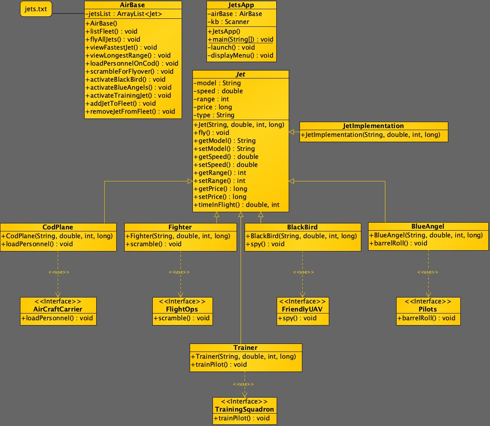

## JetsProject

 

### Description
 This program is intended to allow a user to choose from a series of menu option which have various effects on a fleet of jets located on an air base. Users can add jets to the fleet, remove jets from the fleet, and much more.

 ### Topics and Technologies Used

 * UML Diagrams
 * Constructors
 * Loops
 * If statements
 * Objects
 * Encapsulation
 * Inheritance
 * Switches
 * Formulas
 * Scanners
 * Polymorphism
 * Interfaces
 * Abstract Classes
 * ToStrings
 * Getters and Setters
 * Hashcode() and Equals()
 * Methods
 * This Key Word
 * StringBuilders
 * Super()
 * Buffered Readers
 * ArrayList
 * Arrays
 * Parsing
 * Exception Management and More

 ### How to Run

* To run the application:

* Open your Java supported IDE of choice
* Run as a Java application
* When the program starts you will be presented
  with a menu prompting you to choose from various options
* Options will include: List Fleet, Fly all jets, View fastest jet,
  View jet with the longest range, Lead personnel onto COD,
  Scramble fighter jet for flyover, Activate BlackBird for recon,
  Activate Blue Angels for air show, Activate Training jet for training, Add a jet to the fleet, Remove a jet from the fleet, and finally, quit the program.
* When you choose an option, the menu will reappear after the  
  option is executed allowing you to continue choosing options until you decide to quit the program
* When you select the option to quit, the program will be terminated
* If you choose to add/remove a jet, your actions will be reflected
  in the menu options involving your fleet of jets.
* And most importantly... Have fun!

### Thank you for using JetsProject!

### Lessons Learned

  I learned A LOT about inheritance and encapsulation through the entirety of the creation of this application. I truly believe I gained a genuine amount of understand involving the two.

  I learned how difficult UML diagrams can be to create, but the creation of my diagram helped me significantly during my brainstorming process.
